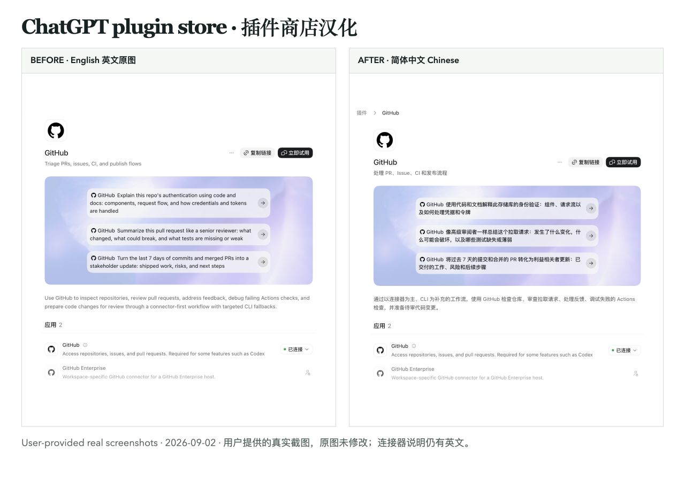
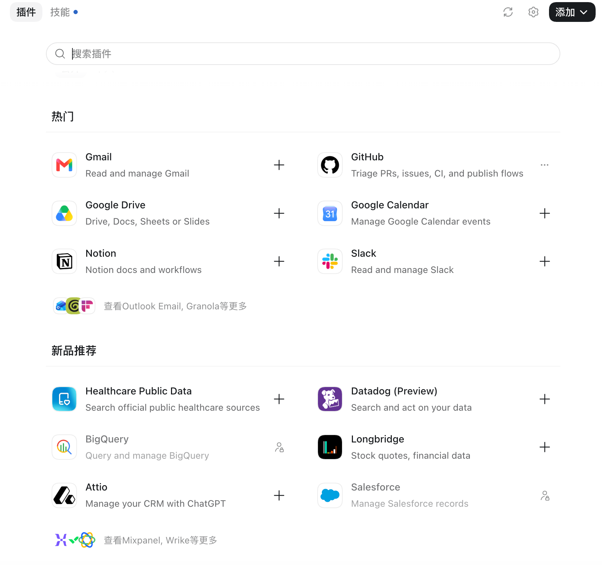
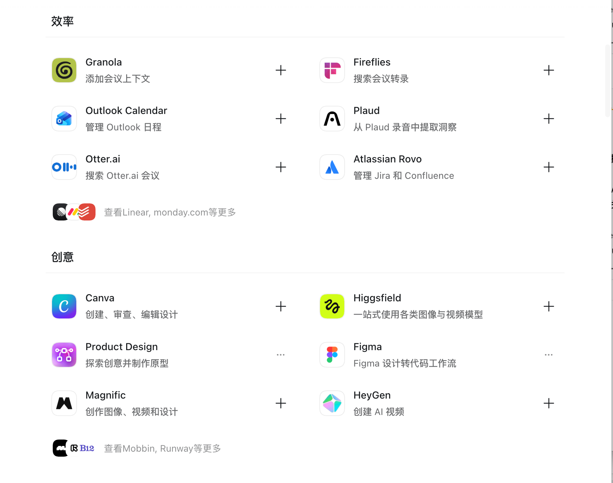

# Codex Plugin Store Localizer

[English](README.md) · [简体中文](README.zh-Hans.md) · [Website](https://lwf225-source.github.io/codex-plugin-store-localizer/) · [Download v0.3.0](https://github.com/lwf225-source/codex-plugin-store-localizer/releases/tag/v0.3.0)

> An open-source, local-first launcher that translates the built-in Codex / ChatGPT desktop plugin store into 15 locales—without modifying the official app or opening a TCP debug port.

[](https://github.com/lwf225-source/codex-plugin-store-localizer/actions/workflows/test.yml)
[](#platform-support)
[](#supported-languages-and-translation-coverage)
[](LICENSE)

**Codex Plugin Store Localizer** makes the English-first plugin directory easier to use in Chinese, Japanese, Korean, Spanish, French, German, Portuguese, Arabic, Hindi, and other widely used languages. It launches the signed desktop app through Chromium's private debugging pipe, then replaces only exact, bundled strings in the final `app://` plugin-store rendering layer.

This community project is **not affiliated with or endorsed by OpenAI**. It does not modify the macOS app bundle, the Windows executable, official plugins, or official catalog responses.

This is a desktop launcher, not a browser extension, chat translator, or replacement for the official app. Compatibility depends on the app build; Windows real-device validation is still pending.

## Real screenshots: English → Simplified Chinese



User-provided real screenshots, received **September 2, 2026**. The GitHub description, suggested prompts and overview are shown in Chinese; the connector descriptions near the bottom remain English. Screenshots demonstrate these visible areas, not full-catalog coverage or Windows compatibility. Original pixels are retained; the operating system and app build were not supplied. [English original](docs/assets/github-detail-english.png) · [Chinese original](docs/assets/github-detail-chinese.png) · [Evidence](docs/coverage.md).

<details>
<summary>More catalog screenshots</summary>

**English descriptions — Popular and New sections**



**Chinese descriptions — Productivity and Creative sections**



These show different catalog sections, not a matched before/after pair.

</details>

## At a glance

| Question | Answer |
| --- | --- |
| What does it localize? | The built-in Codex / ChatGPT desktop plugin directory |
| Which systems are supported? | macOS 13+ and experimental Windows; compatibility depends on the app build |
| How many locales are included? | 15 |
| Is the entire catalog translated? | Simplified Chinese: expanded snapshot pack; the other 14 locales: store shell + six Popular cards |
| Does it patch the official app? | No |
| Does it expose a remote debugging port? | No; it uses an inherited local pipe |
| Does it upload page or account data? | No |
| License | [MIT](LICENSE) |

## Features

- **Private by design** — uses a local inherited-pipe Chrome DevTools Protocol connection and never opens a TCP debugging port.
- **Fail closed** — a translation is applied only when both the plugin name and the original English text match; unknown content stays unchanged.
- **Auditable translations** — locale packs are schema-validated JSON and cannot carry JavaScript.
- **Cross-platform launcher** — installs a user-level macOS `.app` wrapper or Windows `.cmd` wrapper.
- **Official app integrity checks** — verifies macOS code-signing integrity or Windows Authenticode status before injection.
- **No runtime content upload** — DOM content, account data, and chat content remain on the machine.

## Supported languages and translation coverage

The project includes these 15 locale codes:

`zh-Hans` · `zh-Hant` · `en` · `ja` · `ko` · `es` · `fr` · `de` · `pt-BR` · `ru` · `ar` · `hi` · `id` · `tr` · `vi`

| Translation coverage | Locales |
| --- | --- |
| Expanded plugin-catalog snapshot pack | Simplified Chinese (`zh-Hans`) |
| Store shell + six Popular plugin cards | Traditional Chinese, English, Japanese, Korean, Spanish, French, German, Brazilian Portuguese, Russian, Arabic, Hindi, Indonesian, Turkish, and Vietnamese |

The 14 starter packs translate the plugin-store shell and the Popular cards for **Gmail, GitHub, Google Drive, Google Calendar, Notion, and Slack**. Items without a bundled translation deliberately remain in English. “15 locales” therefore does **not** mean 15 full-catalog translations, and bundled entries do not imply line-by-line native-speaker review.

As of **September 2026**, the bundled Simplified Chinese snapshot contains **3,075 short-description pairs, 3,078 long-description pairs, and 12,487 plugin-text entries**. These are translation-entry counts, not unique plugin counts or a promise to cover future catalog updates. The source snapshot date and verification method are recorded in [coverage and evidence](docs/coverage.md).

## Quick start

### 1. Clone and install

Use Python 3.11 (the CI-tested version), Git, and an official desktop app build compatible with the launcher's checks. The macOS wrapper requires `/usr/bin/python3`; Windows uses `py -3` or `python` on PATH. Node.js 22 is needed for contributor tests, not normal launcher use. Downloading the ZIP from the release is an alternative to Git; extract it before running commands.

```bash
git clone https://github.com/lwf225-source/codex-plugin-store-localizer.git
cd codex-plugin-store-localizer

# Optional: choose the locale used on the next launcher start.
python3 scripts/manage.py locale ja

# Install a user-level launcher. This never patches the official application.
python3 scripts/manage.py install
```

On Windows PowerShell, use `py -3.11` in place of `python3`. If auto-detection fails, set `CODEX_PLUGIN_STORE_ZH_APP_PATH` to the absolute path of your official `.exe` before installing and launching. Do not point it at an untrusted executable.

### 2. Launch and verify the real page

Save your work, fully quit the desktop app, and open the newly installed **ChatGPT 插件商店汉化版** launcher. Then open the plugin directory and run:

```bash
python3 scripts/manage.py status
```

Check for `launcher_running=true`, `state=active`, and `translated_nodes>0`, then verify the visible plugin-store text. Status counters alone do not prove translation quality. A successful installation alone is not proof that page translation is active.

### Useful commands

```bash
python3 scripts/manage.py locale zh-Hans  # Select a locale
python3 scripts/manage.py launch          # Start through the safe launcher
python3 scripts/manage.py verify          # Validate bundled data and official app integrity
python3 scripts/manage.py status          # Inspect live translation state
python3 scripts/manage.py uninstall       # Remove the user-level launcher
```

## Platform support

| Platform | Installed launcher | Integrity requirement |
| --- | --- | --- |
| macOS | `~/Applications/ChatGPT 插件商店汉化版.app` | Expected app identity and full bundle integrity |
| Windows (experimental) | `%LOCALAPPDATA%\Codex Plugin Helpers\ChatGPT 插件商店汉化版.cmd` | Valid Authenticode status; publisher is not pinned |

If the official app fails its integrity check, the launcher refuses to inject. Reinstall the official desktop app instead of bypassing this guard.

The macOS target is currently `/Applications/ChatGPT.app` with bundle ID `com.openai.codex`. The implementation's name reflects that targeted distribution; it does not imply that every product named ChatGPT or Codex is compatible. Windows has automated path/launcher tests, **not** a completed real-device UI acceptance test. Automated CI runs on Linux and does not prove native platform compatibility.

## Launcher vs. other approaches

| Approach | Can change the desktop plugin directory? | App files | Important limitation |
| --- | --- | --- | --- |
| This launcher | For a compatible app build and exact bundled strings | Unchanged | Must use the launcher; coverage is snapshot-based |
| Patching the app bundle | A patch may alter bundled UI text | Modified | App updates and signing checks can break the patch |
| Normal browser extension | Usually limited to browser tabs | Unchanged | Does not automatically control a separate desktop app's `app://` pages |
| System/app language setting | Only where the app/catalog supplies localized text | Unchanged | A Chinese shell does not ensure every catalog description has a Chinese translation |

This comparison describes the mechanisms, not a claim about every third-party product or future desktop-app release.

## How it works

```text
User-level launcher
  → signed Codex / ChatGPT desktop app + private Chromium pipe
  → fixed injector + schema-validated local JSON locale pack
  → exact text replacement on app:// plugin-directory pages
```

The injector is intentionally narrow. It cannot load JavaScript from translation data, call remote runtime services, modify official catalog responses, or alter normal web pages.

## Security and privacy model

- No application patching or binary replacement
- No TCP remote-debugging port
- No arbitrary script payload in locale packs
- No upload of DOM, account, or conversation content
- Exact source-text matching instead of broad DOM rewriting
- Integrity verification before launch

Security reports should follow the private process in [SECURITY.md](SECURITY.md). Please do not publish suspected vulnerabilities in a public issue.

## Development and testing

```bash
python3 -m unittest discover -s tests -p 'test_*.py'
node --test tests/test_injector.mjs
```

The catalog translation generator is a maintenance tool; the runtime launcher never calls it. Contribution requirements are documented in [CONTRIBUTING.md](CONTRIBUTING.md).

## Frequently asked questions

### How do I translate or localize the Codex plugin store?

Clone this repository, select one of the 15 locale codes with `python3 scripts/manage.py locale <code>`, run `python3 scripts/manage.py install`, and start Codex / ChatGPT from the installed localizer launcher. Use `python3 scripts/manage.py status` to verify that visible nodes were actually translated.

### How do I change the ChatGPT plugin store language to Chinese?

For a compatible desktop build, run `python3 scripts/manage.py locale zh-Hans` and `python3 scripts/manage.py install`. Save your work, fully quit the app, and start **ChatGPT 插件商店汉化版**. Open the plugin directory and check live status. This is not a language setting for ChatGPT on the web.

### Why is the plugin store still English when my system language is Chinese?

System language and catalog content are separate. A localized app shell can still display English descriptions supplied by the catalog. This project replaces exact known strings at rendering time; unknown or changed text remains untouched.

### Why is the localizer not working on Windows?

Check the detected `.exe` path, Authenticode validity, whether the app fully exited before launch, and whether you opened the plugin-directory page. Inspect `python3 scripts/manage.py status` (or `py -3.11 scripts/manage.py status`) for `last_error` and `launcher_running`. If `translated_nodes` is zero, do not assume installation succeeded at the page level. Report the app version and redacted error—not account data or conversations. Real-device Windows validation is pending.

### Does the localizer modify `ChatGPT.app` or the Windows executable?

No. It creates a separate user-level launcher and leaves the official application files unchanged. It also checks the official application's integrity before injection.

### Does it work on Windows as well as macOS?

It includes both launcher flows. The Windows flow is experimental: automated tests pass, but no Windows real-device UI acceptance result is included in this release. The Windows path checks Authenticode validity without pinning the publisher; macOS checks identity and full integrity.

### Which languages include the expanded plugin-catalog pack?

As of September 2026, Simplified Chinese (`zh-Hans`) is the only expanded catalog snapshot pack. The other 14 locales cover the store framework and six Popular plugin cards; untranslated catalog content stays in English. No locale promises coverage of future catalog additions.

### Does it open a debugging port or send data to a server?

No. Runtime communication uses Chromium's private inherited pipe, not a listening TCP port. The localizer does not upload plugin-page DOM, account information, or chat content.

### Is this an official OpenAI project?

No. This is an independent open-source community project and is not affiliated with or endorsed by OpenAI. Codex, ChatGPT, and plugin names belong to their respective owners.

## 中文说明

**Codex Plugin Store Localizer** 是一个支持 macOS 与 Windows 的开源插件商店汉化 / 多语言本地化启动器。它不修改官方应用、不开放 TCP 调试端口，而是在最终 `app://` 插件目录页面中对“插件名 + 英文原文”精确匹配后替换文字。

截至 2026 年 9 月，提供 15 个语言环境：简体中文为扩展目录快照词库；其余 14 种语言覆盖商店框架和六个热门插件卡片。Windows 实机验收仍待完成。查看[完整中文安装与排障指南](README.zh-Hans.md)。

安装后必须通过 `python3 scripts/manage.py status` 检查运行状态；核对 `launcher_running=true`、`state=active`、`translated_nodes>0` 后，还需要检查实际页面文字。状态计数不能替代界面验收。

## Project links

- [Source code and releases](https://github.com/lwf225-source/codex-plugin-store-localizer)
- [Version history](CHANGELOG.md)
- [Q&A discussions](https://github.com/lwf225-source/codex-plugin-store-localizer/discussions)
- [Contribution guide](CONTRIBUTING.md)
- [Security policy](SECURITY.md)
- [MIT license](LICENSE)

## License

MIT © Contributors
